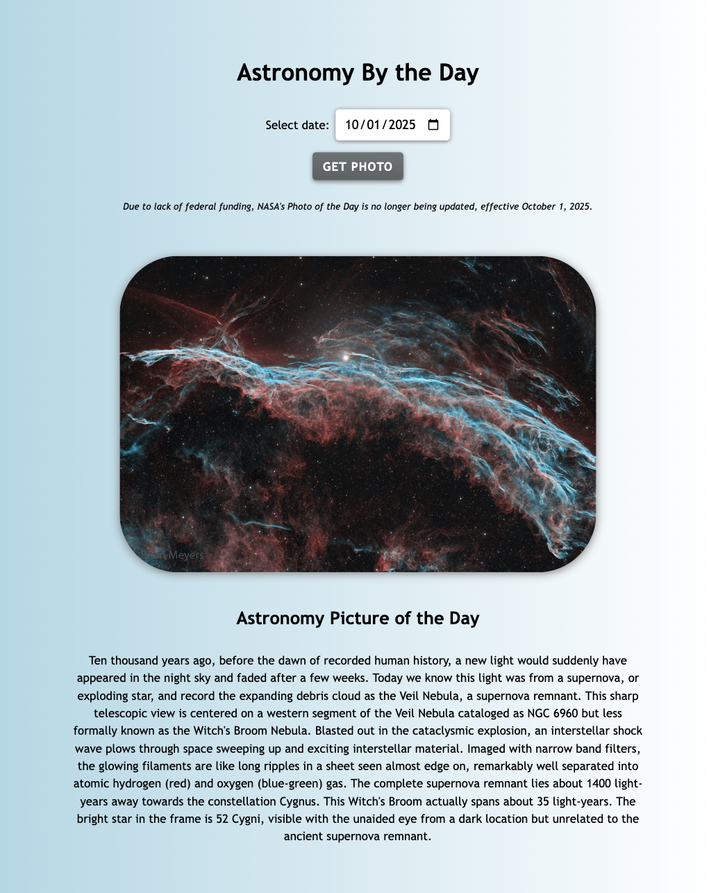

# Simple NASA API

> View NASA's Photo/Video of the Day by selecting your desired date.

> 

## Table of Contents

1. [Tech Stack](#tech-stack)
1. [Development](#development)
   1. [NASA API](#nasa-api)
   1. [Notes](#notes)

## Tech Stack

- **HTML**
- **CSS**
- **JavaScript**

## Development

### NASA API

- Obtain a free API key from NASA at: https://api.nasa.gov/
- Update the `NASA_API_KEY` value with your key on line 1 of main.js.
- Open the app in your browser, and select a date to view the photo/video of the day!

### Notes

Visit the official documentation at https://api.nasa.gov/ for more information on API use, copyright, and rate limitations.

_Due to lack of Federal funding, NASA's photo/video of the day API is no longer being updated beyond October 1, 2025._
